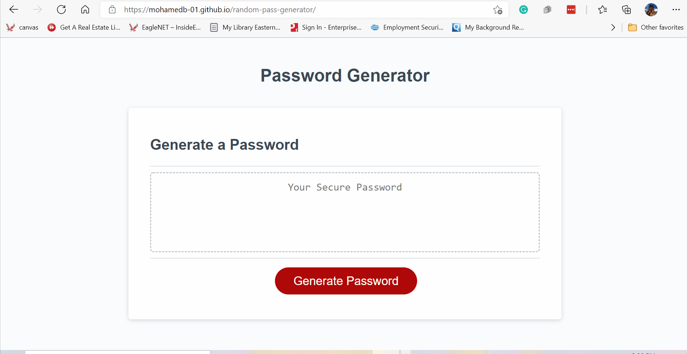

# random-pass-generator

## Table of Contents
- [Description](#Description)
- [Installation](#Installation)
- [Usage](#Usage)
- [Contributing](#Contribution)
- [Tests](#Tests)
- [License](#License)
- [Contact](#Contact)
- [Link to Repository](#Repository)
- [Link to Deployed page](#Deployed)
    
## Description
an application that enables employees to generate random passwords based on criteria that they’ve selected. The application answers to the following user story and acceptance criteria.   

### User Story

```md
AS AN employee with access to sensitive data
I WANT to randomly generate a password that meets certain criteria
SO THAT I can create a strong password that provides greater security
```

### Acceptance Criteria

```md
GIVEN I need a new, secure password
WHEN I click the button to generate a password
THEN I am presented with a series of prompts for password criteria
WHEN prompted for password criteria
THEN I select which criteria to include in the password
WHEN prompted for the length of the password
THEN I choose a length of at least 8 characters and no more than 128 characters
WHEN prompted for character types to include in the password
THEN I choose lowercase, uppercase, numeric, and/or special characters
WHEN I answer each prompt
THEN my input should be validated and at least one character type should be selected
WHEN all prompts are answered
THEN a password is generated that matches the selected criteria
WHEN the password is generated
THEN the password is either displayed in an alert or written to the page
```

        
## Installation & Usage
 
        
Navigate to the deployed app page in a browser to start using the app. 


Demo 


        
## Contribution
Mohamed Bassiouni
        
## Tests
NA.
        
## License
This project is licensed under the terms of the following license: 
    
[](https://opensource.org/licenses/MIT)
    
        
## Contact
GitHub: [MohamedB-01](https://github.com/MohamedB-01). 
    
For inquiries, please contact m.m.bassiouni@gmail.com.
    
## Link to Repository 
https://github.com/MohamedB-01/random-pass-generator
    
## Link to Deployed page

https://mohamedb-01.github.io/random-pass-generator/
